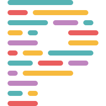

# Portfolio

This is the code for my portfolio page, where I share my experience and journey as a software and robotics engineer.

## Languages and Technologies used:

TypeScript

React

Tailwind

Next.js

EmailJS

Prettier

Vercel
